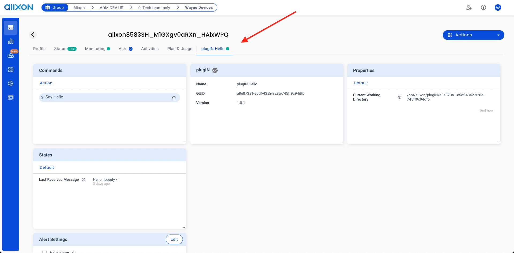

**Allxon Octo** SDK is implemented in C++ and available for 3rd party developers to build your plugin to connect your device to **Allxon Portal**.

You can build your application to power your device on Allxon Portal through Allxon Octo SDK, we call the application "**plugin**".

## Requirements

Your device must get online on [Allxon Portal](https://dms.allxon.com/next/signin).

:::info

Following few step to get your device online on Allxon Portal:
1. [Install **Allxon Agent**](https://www.allxon.com/knowledge/install-allxon-agent-via-command-prompt) in your device.
2. Get pairing code on your device add your device on [Allxon Portal](https://dms.allxon.com/next/signin).

:::

## Try to Run Hello Plugin

### Download Plugin Package

[Download hello plugin](https://github.com/allxon/plugIN-hello/releases) and extract it, we call this archive "**plugin package**".

import Tabs from '@theme/Tabs';
import TabItem from '@theme/TabItem';

<Tabs>
<TabItem value="bash" label="Linux">

```bash
mkdir extracted_folder
tar -xf plugin-hello-X.X.X-linux-x86_64.tar.gz -C extracted_folder
```

</TabItem>
<TabItem value="cmd" label="Windows">

1. Right click `plugin-hello-X.X.X-win-x86_64.zip` file 
2. Click "Extract All..." to `extracted_folder`

</TabItem>
</Tabs>

:::caution

Please check your platform and cpu architecture, For Linux, we only tested on Ubuntu ( > 18.04) and NVIDIA Jetson ( > l4t r32.6.1 )

:::

And you will see extracted folder hierarchy like this.

<Tabs>
<TabItem value="bash" label="Linux">

```
.
├── [APP_GUID]
│   ├── plugin-hello
│   ├── plugin_alert.json
│   ├── plugin_command_ack.json
│   ├── plugin_state.json
│   ├── plugin_update_template.json
│   └── uninstall_plugIN.sh
└── install_plugIN.sh

1 directory, 7 files
```
As you can see, *App GUID* repesent this plugin's id, `uninstall_plugIN.sh` and `install_plugIN.sh` use to install and uninstall your plugin.

</TabItem>
<TabItem value="cmd" label="Windows">

```
.
├── [APP_GUID]
│   ├── libcrypto-1_1-x64.dll
│   ├── libssl-1_1-x64.dll
│   ├── plugin_alert.json
│   ├── plugin_command_ack.json
│   ├── plugin-hello.exe
│   ├── plugin_state.json
│   ├── plugin_update_template.json
│   └── uninstall_plugIN.bat
└── install_plugIN.bat

1 directory, 9 files
```
As you can see, *App GUID* repesent this plugin's id, `uninstall_plugIN.bat` and `install_plugIN.bat` use to install and uninstall your plugin.

</TabItem>
</Tabs>

:::tip

`App GUID` repesent a plugin in particular platform, that means, if you've a plugin deploy on three different platform, you've three different `App GUID`.

:::

### Excute Plugin 
Next, you can directly execute the plugin manually.

<Tabs>
<TabItem value="bash" label="Linux">

```bash
cd extracted_folder/[APP_GUID]
./plugin-hello $(pwd)
```

</TabItem>
<TabItem value="cmd" label="Windows">

```batch
cd extracted_folder\[APP_GUID]
plugin-hello.exe %cd%
```
</TabItem>
</Tabs>

### Install Plugin 
Or install in your device through **plugin online installer**, after that, it will start plugin automatically.

<Tabs>
<TabItem value="bash" label="Linux">

```bash
sudo wget -qO - https://get.allxon.net/plugIN/linux | sudo bash -s -- --app-guid [APP_GUID] --from-path [PLUGIN_PACKAGE]

# For Example
sudo wget -qO - https://get.allxon.net/plugIN/linux | sudo bash -s -- --app-guid a8e873a1-e5df-43a2-928a-745ff9c94dfb --from-path plugin-hello-X.X.X-linux-x86_64.tar.gz
```

</TabItem>
<TabItem value="cmd" label="Windows">

```batch
powershell -command "Invoke-WebRequest -OutFile %temp%\plugin-installer.bat https://get.allxon.net/plugIN/windows" && %temp%\plugin-installer.bat --app-guid [APP_GUID] --from-path [PLUGIN_PACKAGE] 

@REM For Example
powershell -command "Invoke-WebRequest -OutFile %temp%\plugin-installer.bat https://get.allxon.net/plugIN/windows" && %temp%\plugin-installer.bat --app-guid 15dee3c8-adb9-4f7f-83d9-8000eff23f1f --from-path plugin-hello-X.X.X-win-x86_64.zip 
```
</TabItem>
</Tabs>

Ya~ 🥳 ,you should see hello plugin online in your device page.


<!-- 2. Apply a `plugin_key.json` of plugin from Allxon. -->