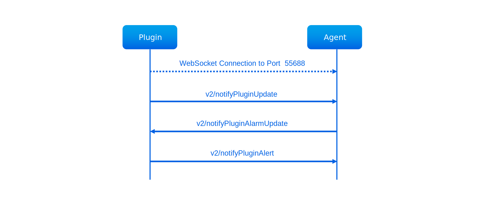
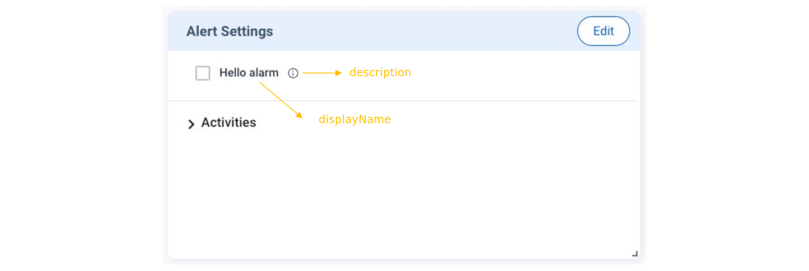
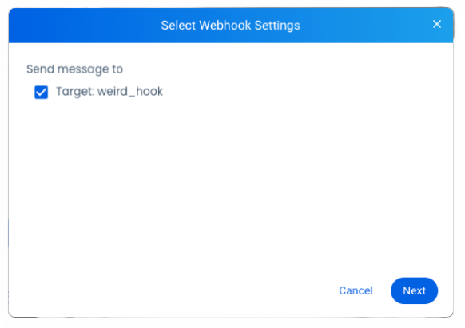
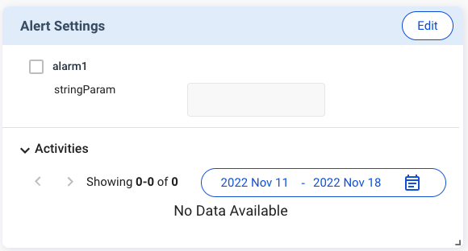
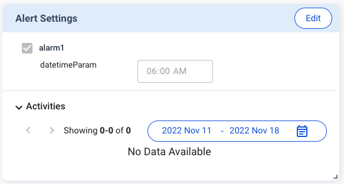

The **Alerts** feature enables you to configure alert thresholds for the plugin to trigger alert messages to Allxon Portal. Then the Portal can send the alert message to you via email, Webhook, LINE, etc., depending on the notification channel setting on the Portal. 

Similar to creating other cards, you need to send `v2/notifyPluginUpdate` to initialize the **Alert Settings** card. Once the initialization is completed, the plugin receives `v2/notifyPluginAlarmUpdate`. With such configuration, whenever the alert threshold is reached, the plugin triggers `v2/notifyPluginAlert` to the Portal.

## Tutorials
Let's look at an example of creating Alerts:

First, send `v2/notifyPluginUpdate` to initialize the **Alert Settings** card. 


```json {17-25}
{
    "jsonrpc": "2.0",
    "method": "v2/notifyPluginUpdate",
    "params": {
        "sdk": "2.0.2",
        "appGUID": "a8e873a1-e5df-43a2-928a-745ff9c94dfb",
        "appName": "plugin-hello",
        "epoch": "1664259325",
        "displayName": "plugIN Hello",
        "type": "ib",
        "version": "1.0.1",
        "modules": [
            {
                "moduleName": "plugin-hello",
                "displayName": "plugIN Hello",
                "properties": [],
                "alarms": [
                    {
                        "name": "hello_alarm",
                        "displayCategory": "Message",
                        "displayName": "Hello alarm",
                        "description": "Trigger when someone say hello",
                        "params": []
                    }
                ]
            }
        ]
    }
}
```

Upon completion, you can see the **Alert Settings** card, as shown below.



At this time, the Alert is not yet set up. The Portal sends the following `v2/notifyPluginAlarmUpate` to the plugin for the initialization.


```json
{
    "jsonrpc": "2.0",
    "method": "v2/notifyPluginAlarmUpdate?authorization=$argon2id$v=19$m=64,t=16,p=8$Y1JmLkNDUjRkeFJ7UDBlOQ$qZPxG/iWuZTKQzbsvr86wg",
    "params": {
        "appGUID": "a8e873a1-e5df-43a2-928a-745ff9c94dfb",
        "epoch": "1664259814"
    }
}
```

:::note
Every time a plugin comes online, the Portal transmits the latest alert settings of the device group to the plugin.
:::

Now you can set up the **Alert Settings** card on Allxon Portal. In this example, let’s try setting up an alert and connecting it to Webhook, so the alert message is sent via Webhook. 

Follow the steps below:

1. Click **Edit** on the upper right corner of the card.
2.  Click the **Webhook** icon


3. Choose a Webhook preset, and click **Next**.



4. Click **Save** to complete the setting.


Once done, the plugin receives a new `v2/notifyPluginAlarmUpdate` as below to notify the plugin that the **Alerts Settings** has been updated.


```json {12-17}
{
    "jsonrpc": "2.0",
    "method": "v2/notifyPluginAlarmUpdate?authorization=$argon2id$v=19$m=64,t=16,p=8$J2chRypQWmxLLGl4O04zXg$KUvzIkRhS8Ao+FYTysdSWA",
    "params": {
        "appGUID": "a8e873a1-e5df-43a2-928a-745ff9c94dfb",
        "epoch": "1664268028",
        "version": "1.0.1",
        "modules": [
            {
                "moduleName": "plugin-hello",
                "epoch": "1664268022",
                "alarms": [
                    {
                        "enabled": true,
                        "name": "hello_alarm"
                    }
                ]
            }
        ]
    }
}
```

Accordingly, the plugin enables the designated alert. 

To test the Alert, send a `v2/notifyPluginAlert`, as shown below.

```json 
{
    "jsonrpc": "2.0",
    "method": "v2/notifyPluginAlert",
    "params": {
        "appGUID": "a8e873a1-e5df-43a2-928a-745ff9c94dfb",
        "moduleName": "plugin-hello",
        "epoch": "1664268861",
        "alarms": [
            {
                "name": "hello_alarm",
                "action": "trigger",
                "time": "1664268861",
                "message": "Hello Buzz ~"
            }
        ]
    }
}
```

You should receive a message on your connected Webhook service. At the same time, Allxon Portal adds a new record to the **Alert** page of the device; all alert records are aggregated on this page.


:::caution
The settings of Alerts and Configs belong to the **group-level**. When the user changes the Alerts/Configs settings on the Portal, the Portal deploys the changes to all the plugins in the same device group. Then Allxon Portal displays the **Alerts/Configs** card based on the latest plugin version in the device group and stores the latest settings. 

When the plugin receives the Alerts/Configs settings, it MUST check whether the settings are supported by the current plugin version. If not supported, the plugin MUST ignore the message. 
:::
 
 ## Display Type

The **Alert Settings** card supports several parameter input types (i.e. displayType): [string](#string), [datetime](#datetime), [switch](#switch), [checkbox](#checkbox), [list](#list), and [temperature](#temperature). For how to set up these input types, see the following sections.

### String

The following example shows the code in `v2/notifyPluginUpdate.json` for displaying a text box for parameter input.

```json title="v2/notifyPluginUpdate.json"
{
    ...
    "alarms": [ 
        {
            "name": "alarm1",
            "params": [
                {
                    "name": "stringParam",
                    "displayType": "string",                
                    "required": false,
                    ...
                },
                ...
            ],
            ...
        }
    ],
}
```

The **Alert Settings** card displays as follows:



When an alert is enabled, `v2/notifyPluginAlarmUpdate` carries a `"name"` and a `"value"` from the parameter input.

```json title="v2/notifyPluginAlarmUpdate.json"
{
    "jsonrpc": "2.0",
    "method": "v2/notifyPluginAlarmUpdate",
    ...
        ...
            ...
                "alarms": [
                    {
                        "name": "alarm1",
                        "params": [
                            {
                                "name": "stringParam",
                                "value": "foo"
                            }
                            ...
                        ]
                        ...
                    }
                    ...
                ]
}

```

### Datetime

The following example shows the code in `v2/notifyPluginUpdate.json` for displaying a date/time picker for parameter input. You must define `"displayFormat"` by using one of the following formats:

* `"YYYY-MM-DD"`
* `"HH:MM"` 
* `"YYYY-MM-DD HH:MM"`

```json title="v2/notifyPluginUpdate.json"
{
    ...
    "alarms": [ 
        {
            "name": "alarm1",
            "params": [
                {
                    "name": "datetimeParam",
                    "displayType": "datetime",                
                    "displayFormat": "HH:MM",
                    "required": false,
                    ...
                },
                ...
            ],
            ...
        }
    ],
}
```
:::info
The time parameter to be sent is not a timestamp and does not contain any time zone information. The plugin executes the command of datetime parameter according to the device's time zone.
:::

The **Alert Settings** card displays as follows:



When an alarm is enabled, `v2/notifyPluginAlarmUpdate` carries a `"name"` and a `"value"` that follows the `"displayFormat"` defined in the `v2/notifyPluginUpdate`.

```json title="v2/notifyPluginAlarmUpdate.json"
{
    "jsonrpc": "2.0",
    "method": "v2/notifyPluginAlarmUpdate",
    ...
        ...
            ...
                "alarms": [
                    {
                        "name": "alarm1",
                        "params": [
                            {
                                "name": "datetimeParam",
                                "value": "06:00"
                            }
                            ...
                        ]
                        ...
                    }
                    ...
                ]
}
```

### Switch

The following example shows the code in `v2/notifyPluginUpdate.json` for displaying a switch toggle for parameter input.  The switch toggle is used to switch between two parameters. You must define `"displayValues"` as a size 2 Array, with index 0 representing false and index 1 representing true. 

```json title="v2/notifyPluginUpdate.json"
{
    ...
    "alarms": [ 
        {
            "name": "alarm1",
            "params": [
                {
                    "name": "switchParam",
                    "displayType": "switch",                
                    "displayValues": [
                        "offValue",
                        "onValue"
                    ],
                    "defaultValue": "offValue",
                    "required": false,
                    ...
                }
            ],
            ...
        }
    ],
}
```

The **Alert Settings** card displays as follows:


When an alert is enabled, `v2/notifyPluginAlarmUpdate` carries a `"name"` and a `"value"` that follows the `"displayValues"` defined in the `v2/notifyPluginUpdate`.

```json title="v2/notifyPluginAlarmUpdate.json"
{
    "jsonrpc": "2.0",
    "method": "v2/notifyPluginAlarmUpdate",
    ...
        ...
            ...
                "alarms": [
                    {
                        "name": "alarm1",
                        "params": [
                            {
                                "name": "switchParam",
                                "value": "offValue"
                            }
                            ...
                        ]
                        ...
                    }
                    ...
                ]
}
```

### Checkbox

The following example shows the code in `v2/notifyPluginUpdate.json` for displaying a checkbox for parameter input. The checkbox is used to enable or disable the parameter. You must define `"displayValues"` as a size 2 Array, with index 0 representing false and index 1 representing true. 

```json title="v2/notifyPluginUpdate.json"
{
    ...
    "alarms": [ 
        {
            "name": "alarm1",
            "params": [
                {
                    "name": "checkboxParam",
                    "displayType": "checkbox",                
                    "displayValues": [
                        "offValue",
                        "onValue"
                    ],
                    "defaultValue": "offValue",
                    "required": false,
                    ...
                }
            ],
            ...
        }
    ],
}
```

The **Alert Settings** card displays as follows:


When an alert is enabled, `v2/notifyPluginAlarmUpdate` carries a `"name"` and a `"value"` that follows the `"displayValues"` defined in `v2/notifyPluginUpdate`.

```json title="v2/notifyPluginAlarmUpdate.json"
{
    "jsonrpc": "2.0",
    "method": "v2/notifyPluginAlarmUpdate",
    ...
        ...
            ...
                "alarms": [
                    {
                        "name": "alarm1",
                        "params": [
                            {
                                "name": "checkboxParam",
                                "value": "offValue"
                            }
                            ...
                        ]
                        ...
                    }
                    ...
                ]
}
```

### List

The following example shows the code in `v2/notifyPluginUpdate.json` for displaying a dropdown list for parameter input. You must define `"displayValues"` as the **Array** type.

The **Alert Settings** card displays as follows:


When an alert is enabled, `v2/notifyPluginAlarmUpdate` carries a `"name"` and a `"value"` that follows the `"displayValues"` defined in `v2/notifyPluginUpdate`.

```json title="v2/notifyPluginUpdate.json"
{
    "jsonrpc": "2.0",
    "method": "v2/notifyPluginAlarmUpdate",
    ...
        ...
            ...
                "alarms": [
                    {
                        "name": "alarm1",
                        "params": [
                            {
                                "name": "listParam",
                                "value": "list1"
                            }
                            ...
                        ]
                        ...
                    }
                    ...
                ]
}
```

### Temperature

The following example shows the code in `v2/notifyPluginUpdate.json` for displaying a predefined temperature scale for parameter input. Users can enter temperature parameters in Fahrenheit or Celsius.

```json title="v2/notifyPluginUpdate.json"
{
    ...
    "alarms": [ 
        {
            "name": "alarm1",
            "params": [
                {
                    "name": "temperatureParam",
                    "displayType": "temperature",                
                    "required": false,
                    ...
                }
            ],
            ...
        }
    ],
}
```

The **Alert Settings** card displays as follows:


When an alarm is enabled, `"v2/notifyPluginAlarmUpdate"` carries a `"name"` and a `"value"` from the temperature parameter input. 

```json title="v2/notifyPluginAlarmUpdate.json"
{
    "jsonrpc": "2.0",
    "method": "v2/notifyPluginAlarmUpdate",
    ...
        ...
            ...
                "alarms": [
                    {
                        "name": "alarm1",
                        "params": [
                            {
                                "name": "temperatureParam",
                                "value": "301.15"
                            }
                            ...
                        ]
                        ...
                    }
                    ...
                ]
}
```

:::note
While the Fahrenheit and Celsius scales are used on the Portal, the temperature data sent to the plugin needs to be in **Kelvin**.
:::

