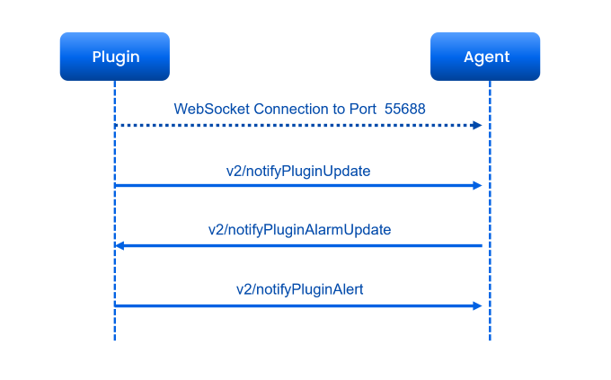
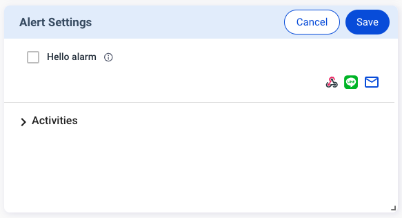

The **Alerts** feature enables you to configure alert thresholds for the plugin to trigger alert messages to Allxon Portal. Then the Portal can send the alert message to you via email, Webhook, LINE, etc., depending on the notification channel setting on the Portal. 

Similar to creating other cards, you need to send `v2/notifyPluginUpdate` to initialize the Alert Settings card. Once the initialization is completed, the plugin receives `v2/notifyPluginAlarmUpdate`. With such configuration, whenever the alert threshold is reached, the plugin triggers `v2/notifyPluginAlert` to the Portal.

Let's look at an example of creating Alerts:

First, send `v2/notifyPluginUpdate` to initialize the **Alert Settings** card. 


```json {17-25}
{
    "jsonrpc": "2.0",
    "method": "v2/notifyPluginUpdate",
    "params": {
        "sdk": "2.0.2",
        "appGUID": "a8e873a1-e5df-43a2-928a-745ff9c94dfb",
        "appName": "plugin-hello",
        "epoch": "1664259325",
        "displayName": "plugIN Hello",
        "type": "ib",
        "version": "1.0.1",
        "modules": [
            {
                "moduleName": "plugin-hello",
                "displayName": "plugIN Hello",
                "properties": [],
                "alarms": [
                    {
                        "name": "hello_alarm",
                        "displayCategory": "Message",
                        "displayName": "Hello alarm",
                        "description": "Trigger when someone say hello",
                        "params": []
                    }
                ]
            }
        ]
    }
}
```

Upon completion, you can see the **Alert Settings** card, as shown below.


At this time, the Alert is not yet set up. The Portal sends the following `v2/notifyPluginAlarmUpate` to the plugin for the initialization.


```json
{
    "jsonrpc": "2.0",
    "method": "v2/notifyPluginAlarmUpdate?authorization=$argon2id$v=19$m=64,t=16,p=8$Y1JmLkNDUjRkeFJ7UDBlOQ$qZPxG/iWuZTKQzbsvr86wg",
    "params": {
        "appGUID": "a8e873a1-e5df-43a2-928a-745ff9c94dfb",
        "epoch": "1664259814"
    }
}
```

:::note
Every time a plugin comes online, the Portal transmits the latest alert settings of the device group to the plugin.
:::

Now you can set up the **Alert Settings** card on Allxon Portal. In this example, let’s try setting up an alert and connecting it to Webhook, so the alert message is sent via Webhook. 

Follow the steps below:

1. Click **Edit** on the upper right corner of the card.
2.  Click the **Webhook** icon



3. Choose a Webhook preset, and click **Next**.


4. Click **Save** to complete the setting.


Once done, the plugin receives a new `v2/notifyPluginAlarmUpdate` as below to notify the plugin that the **Alerts Settings** has been updated.


```json {12-17}
{
    "jsonrpc": "2.0",
    "method": "v2/notifyPluginAlarmUpdate?authorization=$argon2id$v=19$m=64,t=16,p=8$J2chRypQWmxLLGl4O04zXg$KUvzIkRhS8Ao+FYTysdSWA",
    "params": {
        "appGUID": "a8e873a1-e5df-43a2-928a-745ff9c94dfb",
        "epoch": "1664268028",
        "version": "1.0.1",
        "modules": [
            {
                "moduleName": "plugin-hello",
                "epoch": "1664268022",
                "alarms": [
                    {
                        "enabled": true,
                        "name": "hello_alarm"
                    }
                ]
            }
        ]
    }
}
```

Accordingly, the plugin enables the designated alert. 

To test the Alert, send a `v2/notifyPluginAlert`, as shown below.

```json 
{
    "jsonrpc": "2.0",
    "method": "v2/notifyPluginAlert",
    "params": {
        "appGUID": "a8e873a1-e5df-43a2-928a-745ff9c94dfb",
        "moduleName": "plugin-hello",
        "epoch": "1664268861",
        "alarms": [
            {
                "name": "hello_alarm",
                "action": "trigger",
                "time": "1664268861",
                "message": "Hello Buzz ~"
            }
        ]
    }
}
```

You should receive a message on your connected Webhook service. At the same time, Allxon Portal adds a new record to the **Alert** page of the device; all alert records are aggregated on this page.


:::caution
The settings of Alerts and Configs belong to the group-level. When the user changes the Alerts/Configs settings on the Portal, the Portal deploys the changes to all the plugins in the same device group. Then Allxon Portal displays the Alerts/Configs card based on the latest plugin version in the device group and stores the latest settings. When the plugin receives the Alerts/Configs settings, it must check whether the settings are supported by the current plugin version. If not supported, the plugin must ignore the message. 
:::
 
